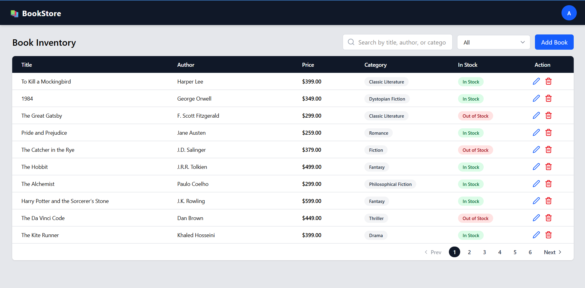
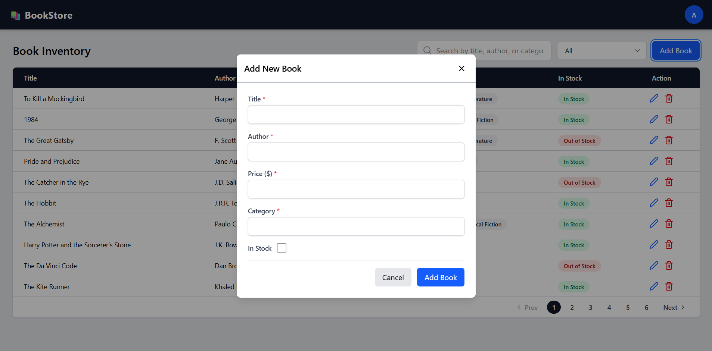

---

# 📚 Book Inventory Dashboard

A modern **Books Inventory Management Dashboard** built with **React** and the **latest Tailwind CSS (v4)**.
This web app allows users to manage a collection of books — including adding, editing, viewing, and deleting book records — all from a clean, responsive interface.

---

## 🚀 Features

✅ **Modern UI** built with React and Tailwind CSS
✅ **Responsive Table** to view and manage book data
✅ **Add / Edit / Delete** book records using modals
✅ **Formik + Yup Validation** for secure, validated forms
✅ **Axios** for API communication (with JWT token support)
✅ **Pagination, Search, and Category Filters** for efficient data handling
✅ **Toast Notifications** for success and error feedback
✅ **Protected Routes** for authenticated access (React Router v6)

---

## 🧩 Tech Stack

| Category           | Technology                                 |
| ------------------ | ------------------------------------------ |
| Frontend Framework | **React 18+**                              |
| Styling            | **Tailwind CSS v4**                        |
| Forms              | **Formik + Yup**                           |
| HTTP Client        | **Axios (with JWT Interceptor)**           |
| Routing            | **React Router v6**                        |
| Toasts             | **react-hot-toast** |

---

## ⚙️ Setup & Installation

1️⃣ **Clone the repository**

```bash
git clone https://github.com/jaymani007/books-inventory.git
cd books-inventory
cd client
```

2️⃣ **Install dependencies**

```bash
npm install
```

3️⃣ **Set up environment variables**
Create a `.env` file in the root folder:

```bash
REACT_APP_API_URL=http://localhost:5000/
```

4️⃣ **Run the development server**

```bash
npm start
```

The app will run at **[http://localhost:3000](http://localhost:3000)**

---

## 📦 Project Structure

```
src/
│
├── components/
│   ├── Navbar.jsx
│   ├── BookTable.jsx
│   ├── BookModal.jsx
|   ├── ProjectedRoute.jsx
│   └── DeleteConfirmModal.jsx
│
├── pages/
│   ├── Dashboard.jsx
│   └── Login.jsx
│
├── services/
│   └── axiosInstance.js
│
├── App.js
├── input.css
├── output.css
└── index.js
```

---

## 🖼️ Screenshots

| Login Page                          | Dashboard                | Book Modal               |
| ---------------------------------- | -------------------------- | -------------------------- |
|  |  |  

---

## 🔐 Authentication

This app supports **JWT-based authentication**.
All API requests automatically include a `Bearer` token (if available in localStorage).

---

## 📜 License

This project is open-source under the [MIT License](LICENSE).

---

